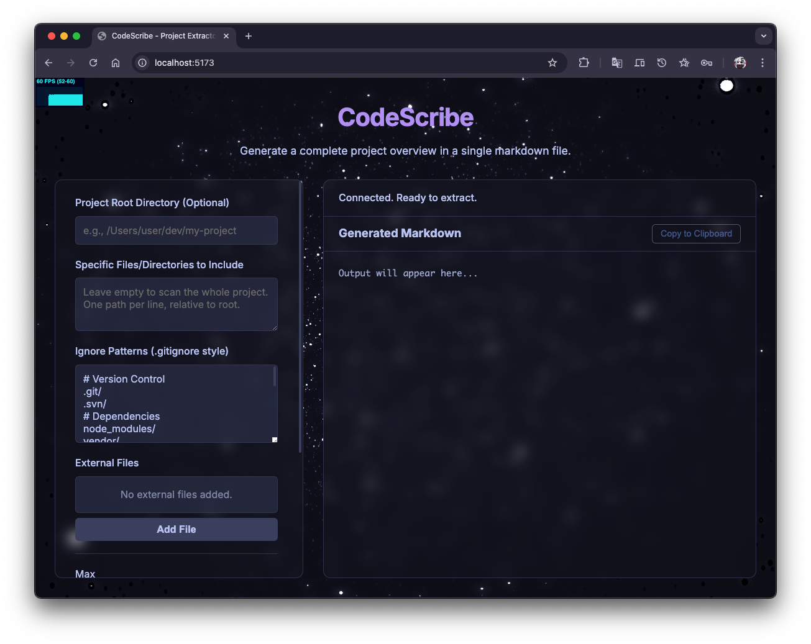

# CodeScribe
A light-weight but powerful tool to extract the file structure and code of a project to Markdown for AI/LLMs prompts.




## Instruction
For backend:
```sh
# Terminal 1
cd backend
pip install -r requirements.txt
python server.py  # runs on port 5172
```

For frontend:
```sh
# Terminal 2
cd frontend
npm install
npm run dev       # runs on port 5173

# Then open http://localhost:5173 in browser
```

or if you prefer static mode:

```sh
# Terminal 2
cd frontend
npm install
npm run build
npx serve dist -l 5173

# Then open http://localhost:5173 in browser
```


## File Structure (Older Ver., Deprecated)
```
project-extractor/
├── app.py                   # Main Flask/Socket.IO application
├── core/
│   ├── __init__.py
│   └── extractor.py         # The core logic for file extraction and processing
├── static/
│   ├── css/
│   │   └── style.css        # Frontend stylesheet
│   └── js/
│       └── script.js        # Frontend JavaScript logic
├── templates/
│   └── index.html           # The main HTML page for the UI
├── .gitignore               # To ignore common Python artifacts
└── requirements.txt         # Python dependencies
```
